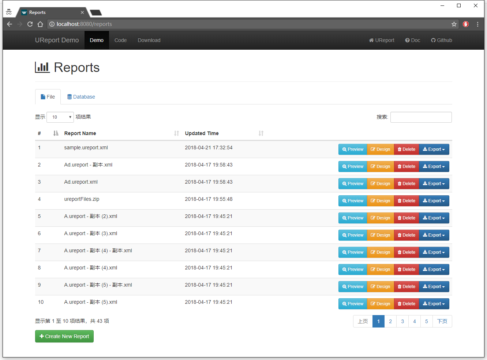
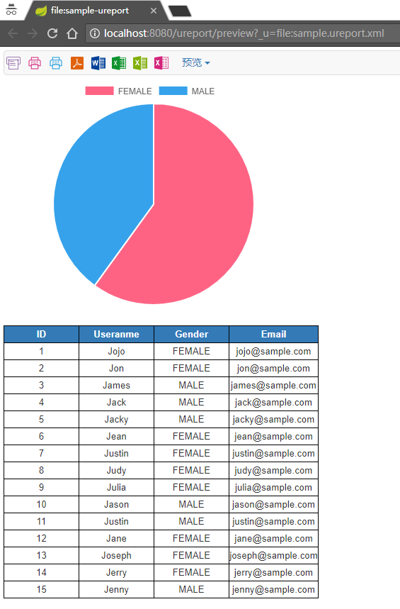

# UReport Demo

此项目是 [UReport](https://github.com/youseries/ureport/) 产品和 Spring Boot 整合后的一个实例

## 使用

Clone
```
git clone https://github.com/yingw/ureport-demo.git --depth=1
```

Run
```
cd ureport-demo & mvn spring-boot:run
```

Or package and Run
```
mvn package & cd target & java -jar ureport-demo-1.0.0.jar
```

启动成功后，访问 http://localhost:8080

> 注：默认设置下会在 Tomcat 的临时目录保存报表，并且在第一次运行时会生成一个 User 数据库（h2 数据库）并生成一个 `sample.ureport.xml` 的报表。

## 设置

如果不需要那个 sample 报表，只需要将 UreportDemoApplication 类中的 `reportService.createSampleReport();` 删掉即可。

如果要在具体路径保存报表，修改 `config.properties` 内的 `ureport.fileStoreDir`

## 系统截图

首页


样例报表预览
